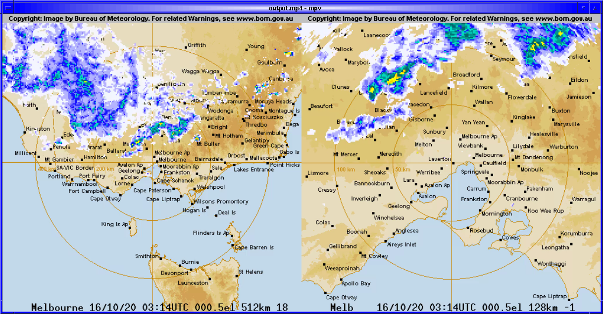
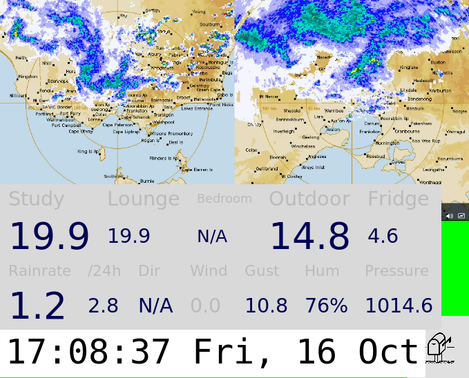

# bomradar
Generates realtime timelapse of recent radar images for Melbourne (or any other Australian BoM radar station or composite)



Can generate either a movie on demand, displaying using mpv by
default.  Or it can generate a movie and pass off to perhaps a command
to redisplay in an already running movie player.

# Dependencies

Depends on puf (parallel version of wget, compatible syntax, it'll
just be a bit slower if you substitute wget):

debian: `sudo apt install puf`

By default, depends on mpv, but you can substitute another movie player via commandline.

If you're going to run continuously in the second mode, feeding into
an already running player, you may want to investigate my slightly modified
[mpvctl](https://gist.github.com/spacelama/6f9fb28bdc8112e4b3c48986b1edb4bc)

# Usage

### Simple, onetime usage: 

radar

### To feed into an existing player, start up a permanent player:

Incorporate it into an always on display on your raspberry pi:



```bash
38204,9> ssh pi grep mpv bin/pidisplay
killall mpv
mpv --geometry 679x340+0+-20 --fullscreen=no --idle --input-ipc-server=$HOME/.mpv-socket --keep-open=yes --loop=inf --quiet &
mpvctl replace /tmp/radar.2/output.mp4  # just get something to display before other GUI elements that partially cover our movie player
```

and update the movie out of cron every minute (for latency, but high
data usage), or 5 minutes (to match the current (late 2020) generation
period, but you might alias with when its pushed to the website):

```bash
38203,8> ssh pi crontab -l | grep radar
* * * * * radar /tmp/radar.1 /tmp/radar.2 mpvctl replace >> /var/log/pidisplay.log 2>&1
```
